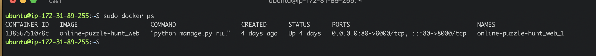
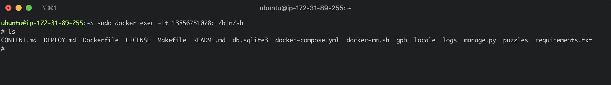

# Docker Commands 

In order to make application changes such as adding admins, you need to interact with the application. The application is inside the docker container so you must enter the docker container with a docker exec command. 

First, you must find the `Container ID` of the running container. You can do this by running: `sudo docker ps`. 



The container ID is `13856751078c` in this case. 

In order to enter the container we need to use the `exec` command: 


```sudo docker exec -it 13856751078c /bin/sh```

Once this command works we are inside the docker container and can work on the running application. 
You can `ls` to verify you are inside the docker container



[More in Depth Explanation](https://www.digitalocean.com/community/tutorials/how-to-use-docker-exec-to-run-commands-in-a-docker-container)